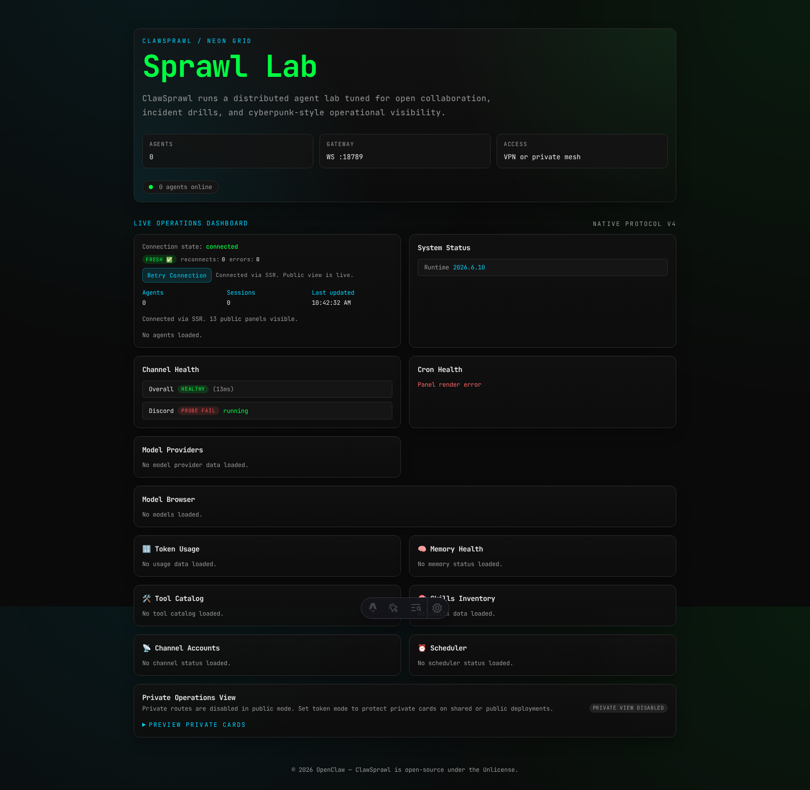
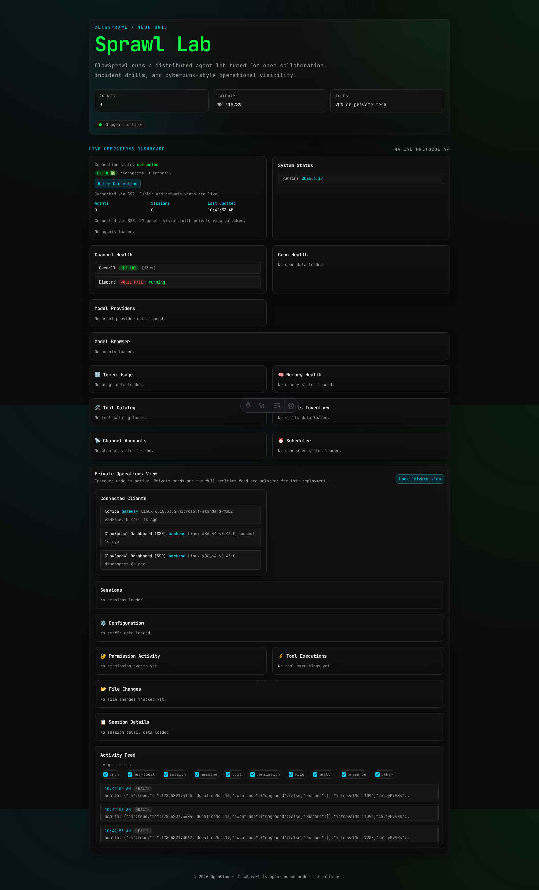

# ClawSprawl 🕶️🤖


ClawSprawl is the Astro-based operations surface for autonomous agent swarms. It combines a terminal-themed narrative shell with a live dashboard connected to the OpenClaw gateway via server-side SSR integration.

Default indexing posture: pages are shipped with `noindex, nofollow` meta robots tags because ClawSprawl is an internal operations surface by default.

## Documentation Hub

- Start here: [`docs/README.md`](docs/README.md)
- Visual architecture and Mermaid flows: [`docs/architecture-overview.md`](docs/architecture-overview.md)
- Deployment, environment, and npm operations (canonical): [`docs/deployment-guide.md`](docs/deployment-guide.md)
- Architecture and roadmap: [`docs/technical-design-plan.md`](docs/technical-design-plan.md)
- Incident response and recovery (canonical): [`docs/operations-runbook.md`](docs/operations-runbook.md)
- API/sourcecode docs: [`docs/heredoc-api-sourcecode.md`](docs/heredoc-api-sourcecode.md)
- Extensions: [`docs/extensions.md`](docs/extensions.md)
- Release and policy: [`CHANGELOG.md`](CHANGELOG.md), [`VERSIONING.md`](VERSIONING.md), [`SECURITY.md`](SECURITY.md)

## Quickstart

```sh
npm install
npm run dev
```

The app runs at `http://localhost:4321`. Copy [`.env.example`](.env.example) to `.env`, set `OPENCLAW_GATEWAY_TOKEN`, and pick a `CLAWSPRAWL_MODE` (`public`, `token`, or `insecure`).

## Architecture

ClawSprawl uses an SSR boundary: browser clients call ClawSprawl APIs, and the server talks to the OpenClaw gateway.

- Gateway service: [`src/lib/gateway/server-service.ts`](src/lib/gateway/server-service.ts)
- Public APIs: [`src/pages/api/public/`](src/pages/api/public)
- Private APIs: [`src/pages/api/private/`](src/pages/api/private)
- Dashboard bootstrap runtime: [`src/lib/dashboard/bootstrap.ts`](src/lib/dashboard/bootstrap.ts)

Design details and data flow live in [`docs/technical-design-plan.md`](docs/technical-design-plan.md).

## Auth Model

ClawSprawl keeps gateway credentials server-side only.

- `OPENCLAW_GATEWAY_TOKEN` is read by the SSR server and never exposed to the browser.
- Public cards load through `/api/public/*` routes.
- In `token` mode, private cards unlock through `/api/private/session` and a secure `httpOnly` session cookie.
- `insecure` mode is for private-network deployments only.

Operational setup guidance: [`docs/deployment-guide.md`](docs/deployment-guide.md). Incident guidance: [`docs/operations-runbook.md`](docs/operations-runbook.md).

## Dashboard States

Public locked state:

<a href="docs/screenshots/main-overview-desktop-public-locked.png">
  
</a>

Private unlocked state:

<a href="docs/screenshots/main-overview-desktop-private-unlocked.png">
  
</a>

- Click either thumbnail to open the full-size screenshot.
- Mobile public locked view: [`main-overview-mobile-public-locked.png`](docs/screenshots/main-overview-mobile-public-locked.png)
- Mobile private unlocked view: [`main-overview-mobile-private-unlocked.png`](docs/screenshots/main-overview-mobile-private-unlocked.png)

## Profile Configuration

Profiles control branding and identity chrome; live operational data always comes from the gateway.

- Built-in profiles: [`src/config/profiles/public-demo.ts`](src/config/profiles/public-demo.ts), [`src/config/profiles/sprawl-lab.ts`](src/config/profiles/sprawl-lab.ts)
- Profile index: [`src/config/profiles/index.ts`](src/config/profiles/index.ts)
- Local private profiles use `*.local.ts` and stay gitignored.

Initialize a local profile scaffold:

```sh
npm run profile:local:init
```

## Quality Pass

Recommended release gate:

```sh
npm run qa:strict
```

Additional commands:

```sh
npm run test
npm run build
npm run test:e2e
```

Coverage targets are enforced in CI:

- Unit coverage: 84%+ via `npm run test:unit:coverage`
- E2E runtime coverage: 80%+ via `npm run test:e2e:coverage`
- Docs coverage: 98%+ via `npm run test:docs:coverage`

## Documentation Screenshots

Regenerate documentation screenshots:

```sh
npm run docs:screenshots
```

Images are stored in [`docs/screenshots/`](docs/screenshots/).

## Release Automation

- npm package publish workflow: [`.github/workflows/publish-gpr.yml`](.github/workflows/publish-gpr.yml)
- GHCR container publish workflow: [`.github/workflows/publish-container.yml`](.github/workflows/publish-container.yml)

## Community

- Contribution guide: [`CONTRIBUTING.md`](CONTRIBUTING.md)
- Code of conduct: [`CODE_OF_CONDUCT.md`](CODE_OF_CONDUCT.md)
- Security policy: [`SECURITY.md`](SECURITY.md)
- Support policy: [`SUPPORT.md`](SUPPORT.md)
- Agent conventions: [`AGENTS.md`](AGENTS.md)
- License: [`LICENSE`](LICENSE)
