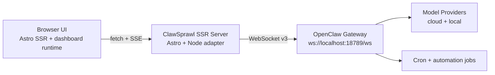
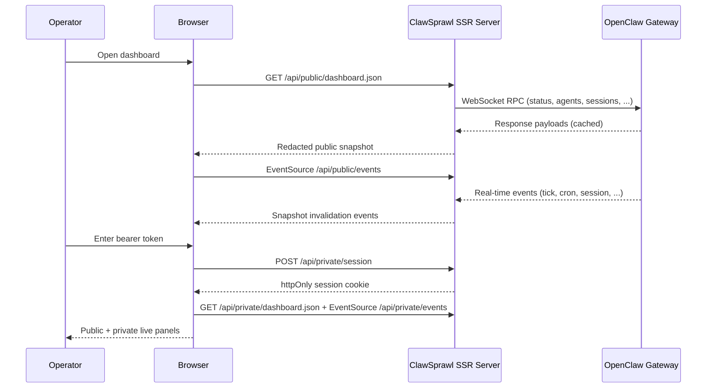

# ClawSprawl 🕶️🤖


ClawSprawl is the Astro-based operations surface for autonomous agent swarms. It combines a terminal-themed narrative shell with a live dashboard connected to the OpenClaw gateway via server-side SSR integration.

Default indexing posture: pages are shipped with `noindex, nofollow` meta robots tags because ClawSprawl is an internal operations surface by default.

## Docs Index

- `docs/README.md`
- `docs/technical-design-plan.md`
- `docs/operations-runbook.md`
- `docs/heredoc-api-sourcecode.md`
- `docs/extensions.md`
- `SECURITY.md`
- `CHANGELOG.md`

## System Flow 🧠





## Architecture 🏗️

ClawSprawl uses an **SSR architecture** where the Astro server holds the gateway token and manages the WebSocket connection to the OpenClaw gateway. The browser never connects to the gateway directly and never holds the gateway token.

- **Server side**: `server-service.ts` maintains a persistent WebSocket connection, caches RPC results, and buffers events
- **Public API routes**: `/api/public/dashboard.json` (redacted snapshot), `/api/public/events` (snapshot invalidation SSE)
- **Private API routes**: `/api/private/session`, `/api/private/dashboard.json`, `/api/private/events`, `/api/private/health.json`
- **Browser side**: `bootstrap.ts` hydrates public cards by default, then layers private cards on the same page after bearer bootstrap + cookie-backed server session

## Local Development 🛠️

```sh
npm install
npm run dev
```

The SSR dev server runs at `http://localhost:4321` by default. Set `OPENCLAW_GATEWAY_TOKEN` in your `.env` file to connect to a running OpenClaw gateway. Choose a `CLAWSPRAWL_MODE` that matches your deployment.

## Ops Controller Script 🎮

Use the control script for common dev/ops workflows:

```sh
npm run ops -- help
```

Useful commands:

- `npm run ops -- status`
- `npm run ops -- init-local-profile`
- `npm run ops -- set-profile --profile private-local`
- `npm run ops -- tmux-up --profile private-local`
- `npm run ops -- tmux-up --local --auto-init-local`
- `npm run ops -- tmux-up --profile-file /path/to/private-profile.ts`
- `npm run ops -- dev --profile-file /path/to/private-profile.ts`
- `npm run ops -- qa-strict`

Direct tmux helper:

```sh
npm run tmux:up -- --profile private-local
```

## Build & Run 📦

```sh
npm run build
npm run start
```

The SSR server runs from `dist/server/entry.mjs`. Set `OPENCLAW_GATEWAY_TOKEN` in the environment for production, then set `CLAWSPRAWL_MODE` for either public-only, token-protected private view, or private-network-only insecure mode.

## Container Image 🐳

ClawSprawl ships a GHCR container image on release tags.

```sh
docker pull ghcr.io/johndotpub/clawsprawl:v0.42.0
```

Run in token mode (recommended for internet-facing deployments):

```sh
docker run --rm -p 4321:4321 \
  -e OPENCLAW_GATEWAY_TOKEN=your_gateway_token \
  -e OPENCLAW_GATEWAY_WS_URL=ws://127.0.0.1:18789/ws \
  -e OPENCLAW_GATEWAY_HTTP_URL=http://127.0.0.1:18789 \
  -e CLAWSPRAWL_MODE=token \
  -e CLAWSPRAWL_PRIVATE_TOKEN=your_private_bearer_token \
  -e CLAWSPRAWL_SESSION_MAX_AGE_HOURS=24 \
  ghcr.io/johndotpub/clawsprawl:v0.42.0
```

Run in public-only mode (private routes disabled):

```sh
docker run --rm -p 4321:4321 \
  -e OPENCLAW_GATEWAY_TOKEN=your_gateway_token \
  -e CLAWSPRAWL_MODE=public \
  ghcr.io/johndotpub/clawsprawl:v0.42.0
```

Danger zone (`insecure`) should stay private-network only. ⚠️

## Test ✅

```sh
npm run test
```

This runs phase hardening tests for scaffold, gateway client (native v3 protocol), 20 dashboard panels, SSR architecture, and reconnect/loading behavior.

## Environment 🔐

Copy `.env.example` to `.env` and adjust values for your environment.

Key variables:
- `OPENCLAW_GATEWAY_TOKEN` (gateway auth token — **server-side only**, never sent to browser)
- `OPENCLAW_GATEWAY_WS_URL` (optional: override gateway WebSocket URL, defaults to `ws://localhost:18789/ws`)
- `OPENCLAW_GATEWAY_SCOPES` (optional: comma-separated scope override; default `operator.read`)
- `CLAWSPRAWL_MODE` (`public`, `token`, or `insecure`)
- `CLAWSPRAWL_PRIVATE_TOKEN` (used only in `token` mode to unlock private cards)
- `CLAWSPRAWL_SESSION_MAX_AGE_HOURS` (optional: max private session lifetime, default `24`, capped at `24`)
- `PUBLIC_MAINFRAME_PROFILE` (`sprawl-lab`, `public-demo`, or your private local profile id)

## Auth Model 🔒

ClawSprawl uses a **server-side only** auth model:

- The `OPENCLAW_GATEWAY_TOKEN` env var is read by the Astro SSR server
- The server connects to the OpenClaw gateway via WebSocket and authenticates using the token
- Requested gateway scopes default to least privilege (`operator.read`)
- Advanced installs can override requested scopes with `OPENCLAW_GATEWAY_SCOPES`
- Public cards load without browser auth via `/api/public/*`
- In `token` mode, private cards require a separate `CLAWSPRAWL_PRIVATE_TOKEN`
- The browser submits that token once as a bearer token to `/api/private/session`
- Successful private unlock creates a secure `httpOnly` server-backed browser-session cookie with server-side max lifetime capped at 24 hours
- `Lock Private View` clears that session cookie immediately
- In `insecure` mode, private routes are intentionally left open for private-network-only deployments
- The gateway token is **never exposed to the browser**

## Configuration Matrix

### 1. Private Network, Public Dashboard Only

```env
CLAWSPRAWL_MODE=public
```

Behavior:
- public cards visible
- private cards stay disabled
- private routes return `401`

### 2. Public Internet, Token-Protected Private View

```env
CLAWSPRAWL_MODE=token
CLAWSPRAWL_PRIVATE_TOKEN=<your-private-bearer-token>
CLAWSPRAWL_SESSION_MAX_AGE_HOURS=24
```

Behavior:
- public cards visible to everyone
- private cards unlock only after bearer-token bootstrap
- private session is server-backed, `httpOnly`, secure, and time-limited

### 3. Private Network, Fully Unlocked

```env
CLAWSPRAWL_MODE=insecure
```

Behavior:
- public and private cards visible immediately
- no private token required
- unsafe for public internet exposure

## Dashboard Visibility Model 👁️

The live dashboard includes:
- stale/fresh badge based on snapshot age
- reconnect and error counters
- public operational cards visible at `/` by default
- usage panel rows that combine `usage.cost` totals with `usage.status` quota windows 📈
- private preview grid with locked titles and reasons before auth
- private realtime cards and raw activity feed only after unlock

## Profile Configuration 🧬

Landing identity and branding chrome are profile-driven. All operational data (agents, providers, cron, sessions) comes from the live gateway — profiles contain no static operational data.

- `public-demo` — safe open-source defaults
- `sprawl-lab` — richer public cyberpunk example (default)
- `private-local` — optional private local profile loaded from ignored local file

Default profile: `sprawl-lab` 🎛️

Local private profile workflow:

1. Run `npm run profile:local:init`
2. Customize with your private topology and workspace paths
3. Set `PUBLIC_MAINFRAME_PROFILE=<your-local-profile-id>`

`*.local.ts` profile files are gitignored (for example, `src/config/profiles/private.local.ts`).

You can also point ops directly at a profile file:

```sh
npm run ops -- tmux-up --profile-file /path/to/private-profile.ts
```

`--profile-file` copies your file into `src/config/profiles/private.local.ts`, auto-detects its `id`, and activates it for that run. You can still force a specific id with `--profile <id>`.

Profile source modules:

- `src/config/profiles/public-demo.ts`
- `src/config/profiles/sprawl-lab.ts`
- `src/config/profiles/*.local.ts` (private, gitignored)
- `src/config/profiles/index.ts`

## Quality Engineering Pass 🧪

Recommended verification sweep:

```sh
npm run test
npm run build
npm run test:e2e
```

One-shot command:

```sh
npm run qa
```

Coverage-gated strict QA command:

```sh
npm run qa:strict
```

Lint-only command:

```sh
npm run lint
```

Coverage targets enforced by scripts:

- Unit coverage: 84%+ (lines/statements/functions/branches) via `npm run test:unit:coverage`
- E2E runtime code coverage: 80%+ via `npm run test:e2e:coverage`
- Heredoc/API docs coverage: 98%+ via `npm run test:docs:coverage`

Unit coverage scope includes all runtime source under `src/**/*.ts` and excludes test files, type-only modules (`**/types.ts`), and the renderer barrel re-export (`src/lib/dashboard/renderers.ts`) to keep coverage signal focused on executable logic.

## Documentation Screenshots 📸

Generate fresh dashboard screenshots for docs:

```sh
npm run docs:screenshots
```

Output directory: `docs/screenshots/`

This capture flow records both dashboard states for docs:
- public locked view
- private full unlocked view (token-mode bootstrap)

## Tailscale Internal Serve Runbook

Build and serve from this repo:

```sh
npm run build
npm run start
```

For Tailscale exposure, map your internal hostname/path to the local SSR server, then keep gateway WS origin allowlist aligned with the serving origin.

## Plan Document

Architecture and phase details live in `docs/technical-design-plan.md`.

## Operations Runbook

Operational procedures live in `docs/operations-runbook.md`.

## API and Sourcecode Documentation

Heredoc-based API/sourcecode documentation lives in `docs/heredoc-api-sourcecode.md`.

## Extension Guide

Extension patterns and checklists live in `docs/extensions.md`.

## Docs Index

Directory-level documentation index lives in `docs/README.md`.

## Release and Versioning 🏷️

- `CHANGELOG.md` contains release history.
- `VERSIONING.md` defines semantic versioning policy.

## Open Source and Community ❤️

- `LICENSE` — project license
- `CONTRIBUTING.md` — contribution workflow
- `CODE_OF_CONDUCT.md` — community expectations
- `SECURITY.md` — vulnerability reporting policy
- `SUPPORT.md` — support expectations
- `AGENTS.md` — agentic development conventions

---

Engineered for the Sprawl 🧠 by OpenCode.
