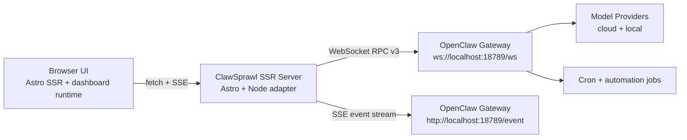
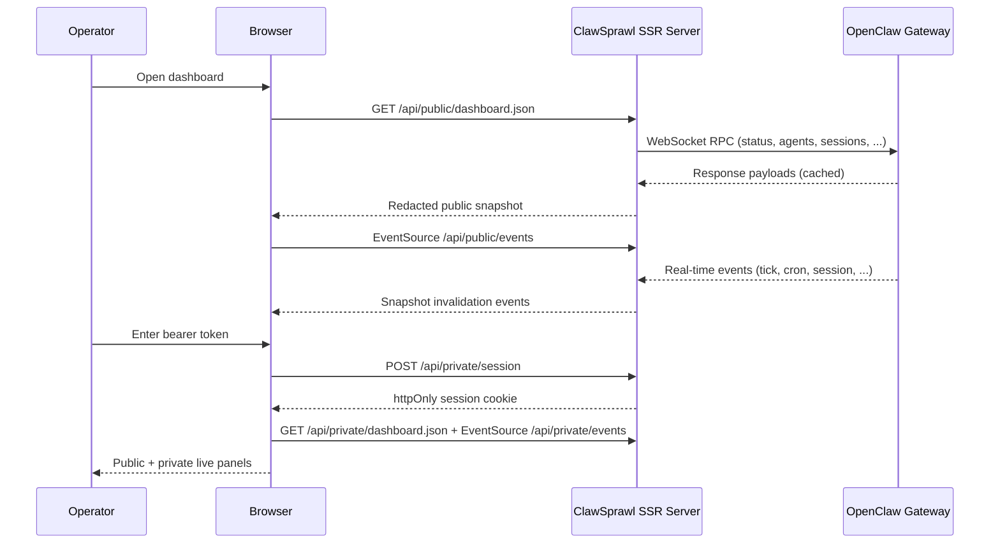

# Architecture Overview

This page captures the visual system model and high-level runtime boundaries.

For deeper implementation and roadmap detail, see [`technical-design-plan.md`](technical-design-plan.md).

## System Flow

ClawSprawl maintains **one primary connection** to the OpenClaw gateway:
1. **WebSocket (RPC + event channel)**: Used for request/response calls (`status`, `agents.list`, `config.get`, etc.) and all broadcast event pushes (`tick`, `health`, `presence`, `agent`, `session.message`, `shutdown`, `update.available`, etc.). Managed by `GatewayClient`.

The gateway event bus is delivered exclusively over WebSocket broadcast events. Prior versions maintained a dual-stream (WS + SSE) architecture via a `GET /event` HTTP endpoint; that endpoint never existed in the canonical gateway surface and the SSE client was retired in v0.43.0.

## Request and Session Flow

## Runtime Boundaries

- Browser never connects directly to the gateway.
- `OPENCLAW_GATEWAY_TOKEN` stays server-side and is never sent to browser clients.
- Public routes provide redacted data; private routes require `token` mode session unlock or `insecure` private-network deployment mode.

## Challenge Nonce Verification

The gateway sends a `connect.challenge` event with a `{ nonce, ts }` payload immediately after WebSocket upgrade. clawsprawl connects device-less (no `device` block, shared-token loopback trust path) and enforces **loopback-only operation**: non-loopback `wss://` gateway URLs are rejected at handshake time with a clear error. Remote gateway support requires implementing device identity + v3 nonce signing (see roadmap).

## Module Anchors

- Gateway service: [`../src/lib/gateway/server-service.ts`](../src/lib/gateway/server-service.ts)
- Access/session model: [`../src/lib/auth/access.ts`](../src/lib/auth/access.ts)
- Dashboard bootstrap: [`../src/lib/dashboard/bootstrap.ts`](../src/lib/dashboard/bootstrap.ts)
- Public APIs: [`../src/pages/api/public/`](../src/pages/api/public)
- Private APIs: [`../src/pages/api/private/`](../src/pages/api/private)
