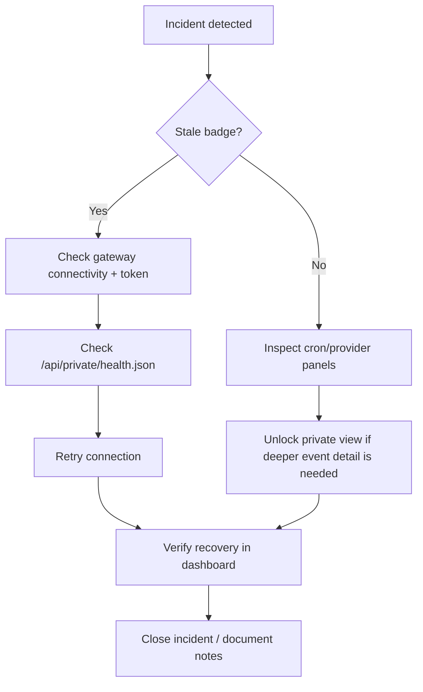

# Operations Runbook

This runbook is the canonical guide for incident triage, recovery, and operator health verification.

For setup and runtime commands, use [`deployment-and-operations.md`](deployment-and-operations.md).
For architecture diagrams and request flow, use [`architecture-overview.md`](architecture-overview.md).

## Operational Endpoints

The SSR server exposes these key routes for incident debugging:

- `GET /api/public/dashboard.json` — cached public-safe snapshot for unauthenticated viewers
- `GET /api/public/events` — public snapshot invalidation SSE plus keepalive ping
- `POST /api/private/session` — validate `Authorization: Bearer <CLAWSPRAWL_PRIVATE_TOKEN>` and create private session cookie in token mode
- `DELETE /api/private/session` — clear private-view session cookie
- `GET /api/private/dashboard.json` — full authenticated snapshot for private cards
- `GET /api/private/events` — authenticated raw gateway SSE stream for private activity surfaces
- `GET /api/private/health.json` — authenticated connection health endpoint
- `GET /api/dashboard.json`, `/api/events`, `/api/health.json` — deprecated legacy routes returning `410`

Public usage panel data combines:
- `usage.cost` (totals + daily rollups)
- `usage.status` (provider quota/remaining summary)

## Incident Triage

### Gateway unreachable

- Check that the OpenClaw gateway is running on the expected host/port.
- Validate `OPENCLAW_GATEWAY_TOKEN` is set correctly in the SSR server environment.
- If private view is enabled, check `/api/private/health.json` for connection state and error counts.
- Use Retry Connection button in dashboard after fix.
- Check stale badge and reconnect/error counters for incident duration and severity.

### Cron failures: Unknown Channel

- Verify Discord channel routing in OpenClaw state/config.
- Confirm cron runs in gateway (`cron.runs`) show improved status after channel fix.
- Use dashboard cron panel error detail text as first-level signal.

### Provider degraded

- If only one provider shows degraded, inspect that provider endpoint and model inventory.
- If all providers degrade simultaneously, inspect gateway/network health first.
- Unlock private view and use event feed filters (`health`, `heartbeat`) for timeline context.

### Incident dashboard flow

1. Review stale badge and reconnect/error counters.
2. Inspect public health, cron, and provider panels first.
3. If deeper operator detail is needed, unlock private view and triage from newest private feed row downward.

## Token Rotation

1. Rotate gateway token in OpenClaw.
2. Update `OPENCLAW_GATEWAY_TOKEN` in the SSR server environment.
3. Restart the SSR server (`npm run start`).
4. Confirm dashboard reconnects and connection status returns to connected.

## Health Verification

1. If private view is enabled, check health endpoint with your session cookie: `curl --cookie "clawsprawl_private_session=<session-id>" http://127.0.0.1:4321/api/private/health.json`
2. Verify `ok: true` and `connectionState: "connected"`.
3. Confirm stale badge shows `fresh ✅` in the dashboard UI.

## Monitoring

### Dashboard indicators

- **Stale badge:** Shows `stale ⚠️` when no successful snapshot received in 90 seconds.
- **Reconnect count:** Number of automatic reconnections since page load.
- **Error count:** Number of errors since page load.
- **Private preview grid:** Shows which panels stay locked without private auth.
- **Private activity feed:** Available only after unlocking private view.

### Health endpoint

The `/api/private/health.json` endpoint returns:
- `ok` — boolean, true when connected to gateway
- `connectionState` — current WebSocket state
- `serverVersion` — OpenClaw gateway version
- `reconnectCount` / `errorCount` — lifetime counters
- `availableMethods` / `availableEvents` — counts of discovered RPC methods and event types

### Metrics endpoint

The gateway exposes `/metrics` for Prometheus-compatible scraping. ClawSprawl surfaces
key operational metrics via its own API routes:

- `/api/private/health.json` — authenticated connection health, uptime, staleness, error/reconnect counters
- `/api/public/dashboard.json` — public snapshot for unauthenticated status surfaces
- `/api/private/dashboard.json` — authenticated full snapshot including private cards

For external monitoring, poll `/api/private/health.json` at 30–60 s intervals and alert on
`connectionState !== "connected"` or `stale === true`.
