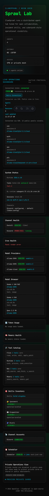
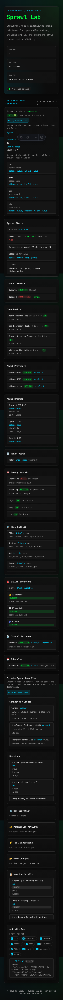
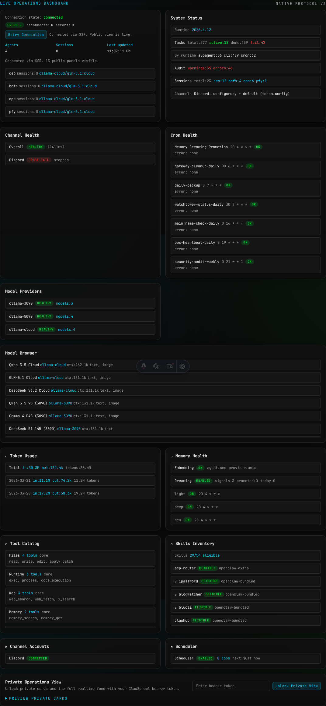
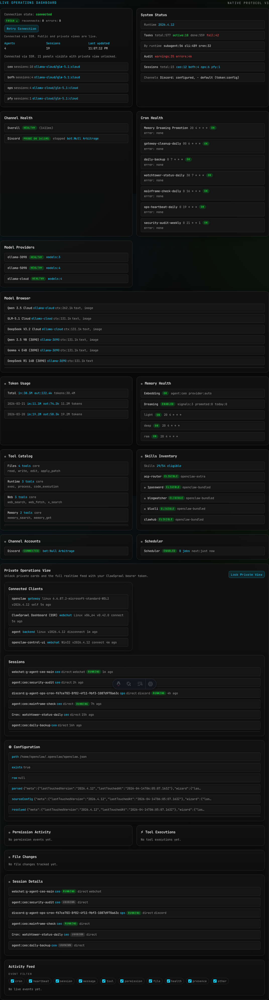
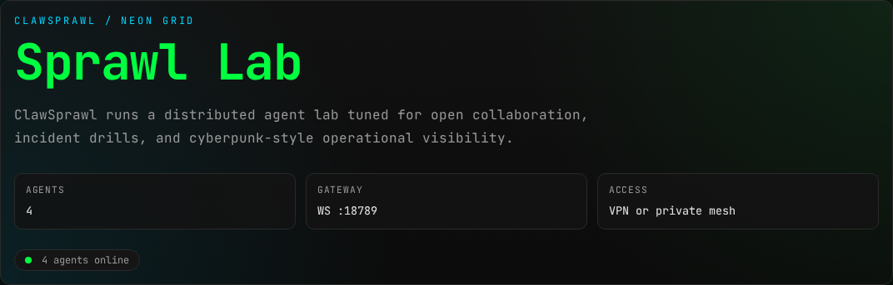

# Screenshot Gallery

Generated documentation screenshots live in this directory.

Regenerate with:

```sh
npm run docs:screenshots
```

## Primary Dashboard States

### Public: private cards locked




### Private: unlocked after token bootstrap




## Live Operations Panel Captures





## Hero Section


